# RAG Evaluation Framework — Project Roadmap

This document describes **all the phases** required to bring the framework from skeleton to a fully functional, thesis-ready tool. Each phase builds on the previous one and includes clear deliverables.

---

## Phase 0 — Project Setup ✅

> **Status**: Completed  
> **Goal**: Establish the project skeleton, dependencies, and development environment.

### Deliverables
- [x] Project directory structure (`src/`, `tests/`, `examples/`, `configs/`, `docs/`)
- [x] `pyproject.toml` with dependencies
- [x] Core data models (`TestSample`, `EvalResult`, `EvalReport`)
- [x] Configuration system (`EvalConfig`, `LLMConfig`)
- [x] Base metric abstract class (`BaseMetric`)
- [x] Metric stubs (faithfulness, relevance, context precision/recall, semantic similarity)
- [x] Basic evaluator pipeline skeleton
- [x] `.gitignore`, `README.md`

### Remaining Setup Tasks
- [ ] Initialize git repository
- [ ] Create virtual environment and install dependencies (`pip install -e ".[dev]"`)
- [ ] Verify the skeleton imports correctly (`python -c "import rag_eval"`)

---

## Phase 1 — LLM Client & Utilities

> **Goal**: Build the multi-provider LLM client that powers all LLM-as-judge metrics and synthetic data generation.

### 1.1 Multi-Provider LLM Client (`utils/llm.py`)
- [ ] Define a `BaseLLMProvider` abstract class with `complete()` and `embed()` methods
- [ ] Implement `OpenAIProvider` (GPT-4o, GPT-4o-mini, o3)
- [ ] Implement `AnthropicProvider` (Claude Sonnet, Opus)
- [ ] Implement `GoogleProvider` (Gemini 2.5 Pro, Flash)
- [ ] Implement `OllamaProvider` (local models via Ollama REST API)
- [ ] Implement `VLLMProvider` (local models via vLLM OpenAI-compatible API)
- [ ] Add retry logic with exponential backoff + jitter
- [ ] Add token counting and cost estimation tracking
- [ ] Write unit tests for each provider (mocked API calls)

### 1.2 Embedding Client (`utils/embeddings.py`)
- [ ] Implement OpenAI embedding support (`text-embedding-3-small`, `text-embedding-3-large`)
- [ ] Implement Sentence Transformers support (local models)
- [ ] Add cosine similarity utility function
- [ ] Write unit tests

### 1.3 Response Caching (`utils/cache.py`)
- [ ] Implement disk-based caching (hash prompt → cached response)
- [ ] Add cache invalidation (TTL-based or manual)
- [ ] Add `--no-cache` flag support for fresh evaluations

### 1.4 Text Processing (`utils/text.py`)
- [ ] Finalize `count_tokens()` for multi-provider support
- [ ] Implement robust `split_into_sentences()` (consider using spaCy or nltk)
- [ ] Implement LLM-based `split_into_claims()` for faithfulness metric

### Deliverables
- Working LLM client that can call any supported provider
- Embedding client for semantic similarity computations
- Caching layer to avoid redundant API calls during development
- Full test coverage for utilities

---

## Phase 2 — LLM-as-Judge Metrics

> **Goal**: Implement the four core LLM-judge metrics with structured prompt engineering.

### 2.1 Faithfulness (`metrics/faithfulness.py`)
- [ ] Design the prompt template for claim extraction
- [ ] Design the prompt template for claim verification against contexts
- [ ] Implement the two-step scoring pipeline:
  1. Extract atomic claims from the answer
  2. Verify each claim against the context chunks
  3. Score = (number of supported claims) / (total claims)
- [ ] Add structured output parsing (JSON mode or function calling)
- [ ] Write unit tests with known inputs/outputs
- [ ] Test with different LLM providers to verify consistency

### 2.2 Answer Relevance (`metrics/relevance.py`)
- [ ] Design the prompt for relevance assessment
- [ ] Implement scoring: LLM rates how well the answer addresses the question
- [ ] Consider the "reverse question" approach: generate questions from the answer, compute similarity with original
- [ ] Write unit tests

### 2.3 Context Precision (`metrics/context_precision.py`)
- [ ] Design the prompt to judge whether each context chunk is relevant to the question
- [ ] Implement scoring: precision = relevant chunks / total chunks
- [ ] Optionally compute precision@k for ranked contexts
- [ ] Write unit tests

### 2.4 Context Recall (`metrics/context_recall.py`)
- [ ] Design the prompt to check if ground truth statements are covered by contexts
- [ ] Implement scoring: extract statements from ground truth, check coverage
- [ ] Score = (covered statements) / (total statements)
- [ ] Write unit tests

### 2.5 Prompt Management
- [ ] Create a `prompts/` directory with Jinja2 templates for each metric
- [ ] Ensure prompts are configurable and versionable
- [ ] Document prompt design decisions

### Deliverables
- Four fully functional LLM-judge metrics
- Prompt templates for each metric
- Tests showing correct scoring on known examples
- Documentation of scoring methodology

---

## Phase 3 — Traditional NLP Metrics

> **Goal**: Implement classical reference-based metrics for fast, cost-free evaluation.

### 3.1 BLEU Score (`metrics/bleu.py`)
- [ ] Implement using `nltk.translate.bleu_score`
- [ ] Support BLEU-1, BLEU-2, BLEU-4 variants
- [ ] Write unit tests

### 3.2 ROUGE Score (`metrics/rouge.py`)
- [ ] Implement using the `rouge-score` library
- [ ] Support ROUGE-1, ROUGE-2, ROUGE-L
- [ ] Return precision, recall, and F1 for each variant
- [ ] Write unit tests

### 3.3 F1 Score (`metrics/f1.py`)
- [ ] Implement token-level F1 between answer and ground truth
- [ ] Handle tokenization and normalization (lowercasing, punctuation removal)
- [ ] Write unit tests

### 3.4 Exact Match (`metrics/exact_match.py`)
- [ ] Implement normalized exact match (strip whitespace, lowercase, remove articles)
- [ ] Write unit tests

### 3.5 BERTScore (`metrics/bert_score.py`)
- [ ] Implement using the `bert-score` library
- [ ] Support configurable base model selection
- [ ] Write unit tests

### 3.6 Semantic Similarity (`metrics/semantic_similarity.py`)
- [ ] Implement embedding-based cosine similarity
- [ ] Use the embedding client from Phase 1
- [ ] Write unit tests

### Deliverables
- Six traditional/embedding metrics fully implemented
- All deterministic metrics have fast execution (no LLM calls)
- Full test coverage

---

## Phase 4 — Dataset System & Synthetic Generation

> **Goal**: Build the data ingestion pipeline and the synthetic dataset generator.

### 4.1 Dataset Loader Enhancements (`datasets/loader.py`)
- [x] Add CSV loading with configurable column mapping
- [x] Add HuggingFace Datasets integration (`datasets` library)
- [x] Add dataset validation (check required fields, warn on missing optional fields)
- [x] Add dataset statistics summary (num samples, avg context length, etc.)

### 4.2 Benchmark Adapters (`datasets/benchmarks/`)
- [x] Implement HotpotQA adapter (multi-hop QA)
- [x] Implement Natural Questions adapter
- [x] Implement TriviaQA adapter
- [x] Implement SQuAD 2.0 adapter
- [x] Implement RGB benchmark adapter
- [x] Implement RECALL benchmark adapter
- [x] Write unit tests for each adapter

### 4.3 Synthetic Data Generator (`datasets/synthetic.py`) ⭐ Central Feature
- [x] Implement document chunking strategy (configurable chunk size/overlap)
- [x] Design LLM prompts for QA pair generation from document chunks
- [x] Implement question type control:
  - Factual questions (single-context)
  - Multi-hop questions (require combining multiple chunks)
  - Reasoning questions (require inference)
  - Comparative questions (compare entities/concepts)
- [x] Implement difficulty levels:
  - Easy: answer is explicit in a single chunk
  - Medium: requires paraphrasing or minor synthesis
  - Hard: requires combining information across chunks
- [x] Implement distractor context injection (plausible but irrelevant chunks)
- [x] Implement automatic ground truth generation
- [x] Add metadata annotation to each sample (source, chunk IDs, question type, difficulty)
- [x] Add deduplication and quality filtering
- [x] Write comprehensive unit tests
- [x] Document the generation methodology for the thesis

### Deliverables
- Robust dataset loading from multiple formats
- Benchmark adapters for standard QA and RAG datasets
- Fully functional synthetic data generator with controllable parameters
- Generated datasets suitable for thesis experiments

---

## Phase 5 — Pipeline & Evaluator

> **Goal**: Complete the evaluation orchestration with batch processing, concurrency, and progress tracking.

### 5.1 Evaluator Enhancements (`pipeline/evaluator.py`)
- [ ] Implement batch evaluation with configurable batch sizes
- [ ] Implement concurrent metric execution via `asyncio.gather()` / `asyncio.Semaphore()`
- [ ] Add progress bar (Rich) for long-running evaluations
- [ ] Add intermediate result saving (resume on failure)
- [ ] Add per-sample error handling (skip failed samples, log errors)
- [ ] Add cost tracking (total tokens used, estimated cost per provider)
- [ ] Write integration tests (end-to-end evaluation on sample data)

### 5.2 Metric Registry (`core/registry.py`)
- [ ] Implement a metric registry mapping string names → metric classes
- [ ] Support auto-discovery of metrics via entry points
- [ ] Allow config-driven metric instantiation with custom parameters

### 5.3 Configuration Comparator (`pipeline/comparator.py`)
- [ ] Implement side-by-side comparison of two or more RAG configurations
- [ ] Compute per-metric deltas and statistical significance
- [ ] Generate comparative report output

### Deliverables
- Production-ready evaluation pipeline
- Support for large-scale evaluations with progress tracking
- Configuration comparison capability

---

## Phase 6 — Reporting & Visualization

> **Goal**: Build comprehensive reporting for analysis and thesis presentation.

### 6.1 Console Reporter
- [ ] Implement Rich-based console output with colored tables
- [ ] Show per-metric summary (mean, median, std, min, max)
- [ ] Highlight best/worst scoring samples
- [ ] Add score distribution visualization (sparkline or bar)

### 6.2 JSON Reporter
- [ ] Export full results as structured JSON
- [ ] Include metadata (config used, timestamp, framework version, cost)
- [ ] Ensure round-trip loading (can reload and continue analysis)

### 6.3 CSV Reporter
- [ ] Export per-sample scores as CSV for spreadsheet analysis
- [ ] Include pivot table-friendly formatting

### 6.4 HTML Reporter
- [ ] Generate standalone HTML report with embedded CSS/JS
- [ ] Include interactive charts (score distributions, radar charts per metric)
- [ ] Include per-sample drill-down tables
- [ ] Add comparative views for multi-config evaluations
- [ ] Consider using Jinja2 templates for report generation

### Deliverables
- Four output formats (console, JSON, CSV, HTML)
- Thesis-quality HTML reports with charts
- Exportable data for further analysis

---

## Phase 7 — CLI Interface

> **Goal**: Provide a user-friendly command-line interface for all operations.

### 7.1 CLI Implementation (`cli/main.py`)
- [ ] Set up CLI framework (Typer or Click)
- [ ] Implement `rag-eval evaluate` command
  - `--config` path to YAML config
  - `--dataset` path to dataset file
  - `--metrics` comma-separated metric names
  - `--output` output directory
  - `--format` output format (json, html, csv, console)
  - `--provider` LLM provider override
- [ ] Implement `rag-eval generate` command (synthetic data)
  - `--documents` path to source documents
  - `--output` output file path
  - `--num-samples` number of samples to generate
  - `--question-types` types of questions
  - `--difficulty` difficulty level
- [ ] Implement `rag-eval report` command (regenerate reports from results)
- [ ] Implement `rag-eval metrics --list` command
- [ ] Register CLI entry point in `pyproject.toml`

### 7.2 CLI Polish
- [ ] Add `--verbose` and `--quiet` flags
- [ ] Add `--dry-run` mode (validate config without running)
- [ ] Add colored output and progress indicators
- [ ] Write CLI usage documentation

### Deliverables
- Fully functional CLI with all core operations
- Help text and usage examples
- Entry point installable via pip

---

## Phase 8 — LangChain Integration

> **Goal**: Enable seamless evaluation of existing LangChain RAG pipelines.

### 8.1 LangChain Adapter (`integrations/langchain.py`)
- [ ] Implement `LangChainAdapter` class
- [ ] Hook into LangChain callbacks to capture:
  - User query
  - Retrieved documents (with metadata, scores)
  - Generated answer
- [ ] Convert LangChain outputs to `TestSample` objects
- [ ] Support both sync and async chains
- [ ] Handle LCEL (LangChain Expression Language) chains
- [ ] Write integration tests with a mock chain
- [ ] Document usage with examples

### Deliverables
- Working LangChain integration
- Example notebook showing end-to-end usage with a LangChain RAG chain

---

## Phase 9 — Testing & Quality Assurance

> **Goal**: Ensure reliability and correctness across all components.

### 9.1 Unit Tests
- [ ] Core models serialization/deserialization
- [ ] Config loading from YAML
- [ ] All metrics with known input/output pairs
- [x] Dataset loaders with sample files
- [x] Synthetic generator output validation
- [ ] LLM client (mocked)
- [ ] Report generators

### 9.2 Integration Tests
- [ ] End-to-end evaluation pipeline (small dataset, real metrics)
- [ ] CLI commands (subprocess tests)
- [ ] LangChain adapter with mock chain

### 9.3 Quality
- [ ] Achieve >80% code coverage
- [ ] Fix all Ruff linting errors
- [ ] Pass mypy strict type checking
- [ ] Review and document all public APIs

### Deliverables
- Comprehensive test suite
- CI-ready test configuration
- Clean linting and type checking

---

## Phase 10 — Documentation & Thesis Integration

> **Goal**: Produce complete documentation and integrate findings into the thesis.

### 10.1 Technical Documentation
- [ ] Complete API reference (docstrings for all public classes/functions)
- [ ] Write user guide (installation, quickstart, advanced usage)
- [ ] Write developer guide (adding new metrics, adding new providers)
- [ ] Document all prompt templates and scoring methodologies

### 10.2 Thesis Integration
- [ ] Document the evaluation methodology in thesis format
- [ ] Design and run experiments comparing RAG configurations
- [ ] Generate thesis-quality figures and tables from HTML reports
- [ ] Write up analysis of results
- [ ] Document limitations and future work

### Deliverables
- Complete technical documentation
- Experiment results and analysis for the thesis
- Reproducible experimental setup

---

## Phase Summary & Dependencies

```mermaid
gantt
    title Project Phases
    dateFormat  X
    axisFormat %s

    section Foundation
    Phase 0 - Setup          :done, p0, 0, 1
    Phase 1 - LLM Client     :p1, 1, 3

    section Metrics
    Phase 2 - LLM-Judge      :p2, after p1, 4
    Phase 3 - NLP Metrics    :p3, after p1, 3

    section Data
    Phase 4 - Datasets       :p4, after p1, 4

    section Orchestration
    Phase 5 - Pipeline       :p5, after p2, 3
    Phase 6 - Reporting      :p6, after p5, 2
    Phase 7 - CLI            :p7, after p5, 2

    section Integration
    Phase 8 - LangChain      :p8, after p5, 2

    section Quality
    Phase 9 - Testing        :p9, after p7, 2
    Phase 10 - Docs & Thesis :p10, after p9, 3
```



### Critical Path

```
Phase 0 → Phase 1 → Phase 2 → Phase 5 → Phase 6/7 → Phase 9 → Phase 10
```

### Parallelizable Phases

The following phases can be developed in parallel after Phase 1 is complete:
- **Phase 2** (LLM-Judge Metrics) and **Phase 3** (NLP Metrics)
- **Phase 3** (NLP Metrics) and **Phase 4** (Datasets)
- **Phase 6** (Reporting) and **Phase 7** (CLI)
- **Phase 8** (LangChain) can be done anytime after Phase 5

---

## Priority Ranking

If time is limited, prioritize in this order:

| Priority | Phase | Reason |
|---|---|---|
| 🔴 Critical | Phase 1 (LLM Client) | Everything depends on this |
| 🔴 Critical | Phase 2 (LLM-Judge Metrics) | Core contribution of the framework |
| 🔴 Critical | Phase 4 (Datasets + Synthetic) | Central to the thesis |
| 🟡 High | Phase 5 (Pipeline) | Needed to run experiments |
| 🟡 High | Phase 3 (NLP Metrics) | Needed for comprehensive evaluation |
| 🟡 High | Phase 6 (Reporting) | Needed for thesis presentation |
| 🟢 Medium | Phase 7 (CLI) | Convenience, not essential for experiments |
| 🟢 Medium | Phase 9 (Testing) | Quality assurance |
| 🔵 Low | Phase 8 (LangChain) | Nice-to-have integration |
| 🔵 Low | Phase 10 (Docs) | Can be done incrementally |
