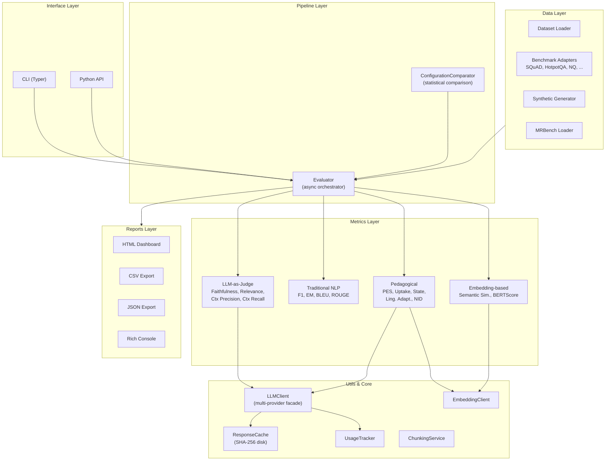
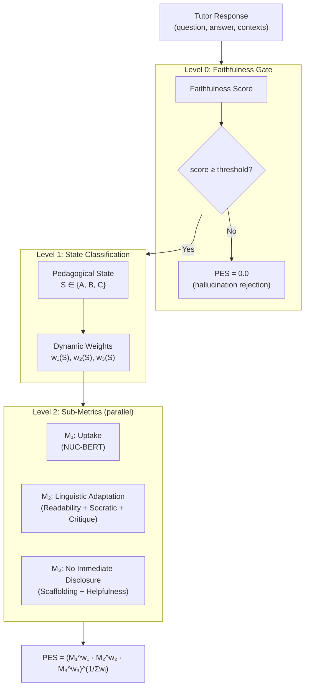

# Proposta di Struttura della Tesi

Proposta completa per la struttura della tesi magistrale, basata sull'analisi approfondita di tutto il lavoro svolto: il framework `rag_eval`, la metrica PES (Pedagogical Evaluation Score), la validazione su MRBench v3, e l'intero ecosistema di metriche, pipeline e strumenti sviluppati.

---

## Titolo proposto

> **"Evaluating Pedagogical Quality in RAG-Based Tutoring Systems: A Framework and Composite Metric Approach"**

Varianti alternative:
- *"PES: A Composite Metric for Evaluating Conversational Tutoring in Retrieval-Augmented Generation Systems"*
- *"Beyond Faithfulness: Multi-Dimensional Evaluation of Educational RAG Agents"*
- *"From Retrieval to Pedagogy: An Extensible Framework for Evaluating AI Tutoring Systems"*

---

## Struttura Capitoli

### Capitolo 1 — Introduzione (~10-12 pagine)

**Obiettivo**: Inquadrare il problema, motivare la ricerca, presentare i contributi.

#### 1.1 Contesto e motivazione
- Crescita dei sistemi RAG e loro adozione in ambito educativo/tutoring
- I Large Language Model come tutor conversazionali: potenzialità e rischi
- Il gap valutativo: le metriche classiche NLP (BLEU, ROUGE, F1) non catturano la qualità pedagogica
- L'insufficienza dell'approccio "LLM-as-a-judge" monocriterio

#### 1.2 Definizione del problema
- Come valutare automaticamente se un tutor AI non solo genera risposte fedeli al contesto, ma lo fa con efficacia pedagogica?
- La necessità di un framework modulare che copra l'intero spettro valutativo: dal retrieval alla generazione alla pedagogia

#### 1.3 Contributi della tesi
Presentare chiaramente i **tre contributi principali**:

| # | Contributo | Natura |
|---|---|---|
| 1 | **Framework `rag_eval`**: architettura modulare, multi-provider, con 15 metriche, generazione sintetica, integrazione LangChain, reporting interattivo | Ingegneria del software |
| 2 | **PES (Pedagogical Evaluation Score)**: metrica composita a 3 livelli che integra faithfulness gating, classificazione pedagogica, uptake conversazionale, adattamento linguistico e scaffolding | Metodologico |
| 3 | **Validazione empirica** su MRBench v3 con analisi statistica (Spearman, ANOVA, Kruskal-Wallis) e confronto cross-model | Sperimentale |

#### 1.4 Struttura della tesi
- Roadmap dei capitoli successivi

---

### Capitolo 2 — Background e Stato dell'Arte (~20-25 pagine)

**Obiettivo**: Fornire le basi teoriche e posizionare il lavoro rispetto alla letteratura.

#### 2.1 Retrieval-Augmented Generation (RAG)
- Architettura RAG: retriever → context augmentation → generator
- Tassonomia dei sistemi RAG (naive, advanced, modular)
- Applicazioni in ambito educativo e tutoring conversazionale

#### 2.2 Valutazione dei sistemi RAG
- **Metriche tradizionali NLP**: BLEU, ROUGE, F1, Exact Match — limiti per la valutazione semantica
- **Metriche basate su embedding**: Semantic Similarity, BERTScore — vantaggi e limiti
- **LLM-as-a-Judge**: il paradigma emergente
  - Faithfulness (decomposizione in claims atomici)
  - Answer Relevance
  - Context Precision e Context Recall
  - Bias noti: verbosity bias, position bias, self-enhancement bias
- **Framework esistenti**: RAGAS, ARES, TruLens, DeepEval — confronto con il nostro approccio

#### 2.3 Valutazione pedagogica dei sistemi conversazionali
- Teorie dell'apprendimento rilevanti: scaffolding (Vygotsky), zona di sviluppo prossimale, questioning socratico
- **Conversational Uptake** (Demszky et al., 2021): NUC-BERT e uptake come proxy di engagement
- **Readability e adattamento linguistico**: Flesch Reading Ease, linguaggio tentativo, critica costruttiva
- **No Immediate Disclosure**: il principio di non rivelare direttamente la risposta nel tutoring
- **MRBench** (Macina et al.): benchmark per math tutoring con annotazioni umane multi-dimensionali

#### 2.4 Tecnologie e strumenti utilizzati
- Large Language Models: architetture (GPT-4, Claude, Gemini, Llama 3, Mistral, Phi-3)
- Modelli di embedding: Sentence Transformers, DeBERTa
- LangChain come framework di orchestrazione RAG
- Ollama e vLLM per l'inferenza locale

---

### Capitolo 3 — Architettura del Framework (~20-25 pagine)

**Obiettivo**: Descrivere in dettaglio il design e l'implementazione del framework `rag_eval`.

#### 3.1 Principi architetturali e design pattern
- **Modularità a livelli**: Interface → Pipeline → Metrics → Datasets → Reports → Core/Utils
- **Registry Pattern**: `MetricRegistry` per la discovery automatica delle metriche
- **Strategy Pattern**: `BaseMetric` come interfaccia polimorfica per tutte le metriche
- **Adapter Pattern**: adattatori per benchmark standard e integrazione LangChain
- **Dependency Injection**: iniezione di `LLMClient` / `EmbeddingClient` nelle metriche

#### 3.2 Modelli di dominio e contratti dati
- `TestSample`: unità atomica di valutazione (question, answer, ground_truth, contexts, metadata)
- `EvalResult`: risultato di una singola metrica su un singolo sample
- `EvalReport`: container aggregato con statistiche computate
- Validazione rigorosa via Pydantic v2 e serializzazione JSON round-trip

#### 3.3 Astrazione multi-provider per LLM
- `BaseLLMProvider` → `complete()` / `complete_json()`
- Provider implementati: OpenAI, Anthropic, Google GenAI, Ollama, vLLM
- `LLMClient` come facade con caching (SHA-256), retry (tenacity), e tracking costi/token
- `MODEL_PRICING`: catalogo costi per token per stima budget sperimentale

#### 3.4 Client di embedding
- `EmbeddingClient` con Sentence Transformers (`all-MiniLM-L6-v2`) e OpenAI embeddings
- Lazy loading, batching, similarità coseno vettorizzata

#### 3.5 Pipeline di valutazione
- `Evaluator`: orchestratore asincrono con `asyncio.Semaphore(max_concurrency)`
- Batching con checkpointing crash-safe (`.rag_eval_cache/checkpoint_batch_{i}.json`)
- Gestione errori a livello di singolo sample (fail-safe, non fail-fast)
- `ConfigurationComparator`: confronto tra configurazioni RAG con t-test accoppiato (SciPy)

#### 3.6 Generazione sintetica di dataset
- `ChunkingService`: chunking semantico basato su distanza coseno dal centroide via `paraphrase-MiniLM-L6-v2`
- Generazione QA multi-tipo: `factual`, `multi-hop`, `reasoning`, `comparative`
- Modulazione difficoltà: `easy`, `medium`, `hard`
- Iniezione di distrattori e simulazione di imperfezioni RAG (70% fedele, 15% allucinazione, 15% senza risposta)

#### 3.7 Adattatori per benchmark standard
- `BaseBenchmarkAdapter` ABC con `load(split, max_samples)`
- Adapter built-in: HotpotQA, SQuAD 2.0, Natural Questions, TriviaQA, RGB, RECALL
- Normalizzazione uniforme verso `TestSample`

#### 3.8 Integrazione LangChain
- `RagEvalCallbackHandler(BaseCallbackHandler)`: intercettazione non-invasiva di chain LCEL
- Cattura automatica di query, documenti recuperati e risposta generata
- `get_samples() → list[TestSample]` per valutazione diretta

#### 3.9 Sistema di reporting
- **Console (Rich)**: tabelle con sparkline Unicode, panel best/worst, riepilogo costi
- **JSON**: export machine-readable con metadata ambiente e configurazione
- **CSV (wide format)**: per analisi con pandas/Excel/SPSS
- **HTML standalone**: dashboard interattiva con Chart.js, radar chart, istogrammi, drill-down — completamente offline con vendor CSS/JS inlined

#### 3.10 CLI
- Costruito con Typer: `evaluate`, `generate`, `report`, `metrics`
- Factory intelligente (`_instantiate_metrics`): ispezione delle signature per iniezione lazy delle dipendenze

---

### Capitolo 4 — Il Pedagogical Evaluation Score (PES) (~20-25 pagine)

**Obiettivo**: Formalizzare la metrica PES — il contributo metodologico principale della tesi.

> [!IMPORTANT]
> Questo è il capitolo chiave della tesi: la formulazione teorica della metrica PES. Deve essere rigoroso, formale e ben motivato.

#### 4.1 Motivazione e intuizione
- Perché le metriche RAG standard (faithfulness, relevance) non bastano per valutare un tutor
- La multidimensionalità della qualità pedagogica: non basta essere corretti, bisogna insegnare bene
- L'idea di una metrica composita a livelli con gating condizionale

#### 4.2 Architettura a 3 livelli del PES

#### 4.3 Level 0 — Faithfulness Gate
- Decomposizione della risposta in claims atomici e verifica nel contesto
- Soglia configurabile (default 0.50): sotto la soglia → PES = 0.0
- Giustificazione: una risposta allucinata non può avere valore pedagogico

#### 4.4 Level 1 — Classificazione dello Stato Pedagogico
- LLM-judge per classificare l'intento del turno del tutor
- **State A (Concept Teaching)**: il tutor introduce nuovi concetti → $w_1=0.40, w_2=0.40, w_3=0.20$
- **State B (Error Remediation)**: il tutor corregge misconcezioni → $w_1=0.20, w_2=0.30, w_3=0.50$
- **State C (Socratic Assessment)**: il tutor pone domande e valuta → $w_1=0.15, w_2=0.25, w_3=0.60$
- Motivazione dei pesi: in State C lo scaffolding (M₃) è cruciale; in State A conta di più l'uptake e l'adattamento

#### 4.5 Level 2 — Sub-Metriche

##### 4.5.1 M₁ — Uptake (Conversational & Context Elaboration)
- **Base teorica**: Demszky et al. (2021) — Next Utterance Classification
- **Implementazione**: `mDeBERTa-v3-base-mnli-xnli` per NLI come proxy di uptake
- Uptake conversazionale (Q→A) e uptake contestuale (C→A)
- Supplemento con overlap lessicale (%-IN-T)
- Score formula e normalizzazione

##### 4.5.2 M₂ — Linguistic Adaptation
Composita a 3 componenti (pesi: 0.4 / 0.3 / 0.3):
- **Readability** (peso 0.4): Flesch Reading Ease normalizzato in [0,1] via `textstat`
- **Socratic Tentativeness** (peso 0.3): rapporto lemmi tentativi/esplorativi (multilingual via `simplemma` + `langdetect`) vs. soglia di saturazione. Dizionari per EN e IT (*perhaps*, *could*, *might* / *forse*, *ipotizzare*, *potrebbe*)
- **Constructive Critique** (peso 0.3): analisi sentiment via `nlptown/bert-base-multilingual-uncased-sentiment` (1-5 stelle) + bonus per marcatori avversativi (*however*, *but* / *tuttavia*, *però*)

##### 4.5.3 M₃ — No Immediate Disclosure & Helpfulness
Composita a 2 componenti (pesi: 0.5 / 0.5):
- **NID Score** (peso 0.5): LLM-judge valuta se il tutor fa scaffolding senza rivelare direttamente la risposta
- **Helpfulness** (peso 0.5): LLM-judge su scala 1-5 normalizzata — quanto la risposta supporta l'apprendimento dello studente

#### 4.6 Formulazione matematica completa

$$\text{PES}(r) = \begin{cases} 0 & \text{se } \text{Faithfulness}(r) < \tau \\\\ \left( M_1^{w_1(S)} \cdot M_2^{w_2(S)} \cdot M_3^{w_3(S)} \right)^{\frac{1}{w_1(S) + w_2(S) + w_3(S)}} & \text{altrimenti} \end{cases}$$

- Proprietà della media geometrica pesata: penalizza più severamente i valori bassi
- Analisi di sensitività ai pesi
- Confronto con alternative: media aritmetica, media armonica, somma pesata

#### 4.7 Scelte di design e trade-off
- Perché la media geometrica e non aritmetica
- Perché il gating binario (faithfulness) e non un fattore moltiplicativo continuo
- Perché 3 stati e non N
- Limitazioni note e possibili estensioni

---

### Capitolo 5 — Le metriche di valutazione RAG (~15-18 pagine)

**Obiettivo**: Descrivere formalmente tutte le metriche implementate nel framework (quelle non-PES).

#### 5.1 Tassonomia delle metriche

| Categoria | Metriche | Dipendenze |
|---|---|---|
| LLM-as-Judge | Faithfulness, Answer Relevance, Context Precision, Context Recall | LLM client |
| Lexical NLP | Token F1, Exact Match, BLEU, ROUGE | Standalone |
| Embedding-based | Semantic Similarity, BERTScore | Embedding client |

#### 5.2 Metriche LLM-as-Judge
Per ciascuna: formulazione, prompt template, calcolo dello score, limiti noti

- **Faithfulness**: claim extraction → context verification → $\frac{\text{supported}}{\text{total}}$
- **Answer Relevance**: direct LLM rating in [0,1] con reasoning
- **Context Precision**: $\frac{\text{relevant chunks}}{\text{total chunks}}$
- **Context Recall**: statement extraction da ground truth → coverage check → $\frac{\text{covered}}{\text{total}}$

#### 5.3 Metriche NLP tradizionali
- **Token F1**: precision/recall a livello token con normalizzazione SQuAD-style
- **Exact Match**: match binario con normalizzazione (lowercase, rimozione articoli/punteggiatura)
- **BLEU**: n-gram precision con smoothing Chen & Cherry
- **ROUGE**: ROUGE-1, ROUGE-2, ROUGE-L (LCS)

#### 5.4 Metriche basate su embedding
- **Semantic Similarity**: cosine similarity di sentence embeddings
- **BERTScore**: matching token-level con embedding contestuali DeBERTa

#### 5.5 Confronto e complementarità
- Tabella riassuntiva: cosa cattura ciascuna metrica, cosa non cattura
- Quando usare quale metrica
- La complementarità LLM-judge + metriche tradizionali

---

### Capitolo 6 — Setup Sperimentale e Risultati (~25-30 pagine)

**Obiettivo**: Presentare gli esperimenti condotti, i dati, e i risultati con rigore statistico.

> [!IMPORTANT]
> La fase di evaluation con il nuovo benchmark è ancora in corso. Questo capitolo andrà completato con i risultati finali.

#### 6.1 Domande di ricerca

- **RQ1**: Il PES è in grado di discriminare tra risposte pedagogicamente efficaci e inefficaci, in accordo con il giudizio umano?
- **RQ2**: Quali modelli LLM producono risposte tutoriali di qualità pedagogica superiore?
- **RQ3**: Le sotto-metriche del PES (M₁, M₂, M₃) correlano individualmente con le annotazioni umane?
- **RQ4**: Quale impatto ha la scelta del modello LLM-judge sulla stabilità e affidabilità del PES?

#### 6.2 Dataset e benchmark
- **MRBench v3**: dataset di tutoring matematico con conversazioni multi-turno
  - Struttura: esercizio → dialogo studente-tutor → annotazioni umane multi-dimensionali
  - Label di ground truth: `providing_guidance` (No / To some extent / Yes), `combined_score`
  - Modelli inclusi: GPT-4, Claude 3.5 Sonnet, Gemini, Llama 3.1 (8B e 405B), Mistral, Phi-3, Expert Tutor, Novice Tutor
- **Dataset sintetico**: generato dal framework per test di robustezza
- *(Eventuale nuovo benchmark — da completare)*

#### 6.3 Configurazione sperimentale
- Modello LLM-judge: Ollama con `llama3.2` (locale, temperature=0.0)
- Embedding: `all-MiniLM-L6-v2` via Sentence Transformers
- NUC-BERT: `mDeBERTa-v3-base-mnli-xnli`
- Sentiment: `nlptown/bert-base-multilingual-uncased-sentiment`
- Soglia faithfulness: configurabile (default 0.50)
- Hardware e tempi di esecuzione

#### 6.4 Risultati — Validazione PES su MRBench

##### 6.4.1 Correlazione con annotazioni umane
- Spearman $\rho$ globale: PES vs. `providing_guidance` e vs. `combined_score`
- Correlazioni per singolo modello
- Correlazioni per singola sub-metrica (M₁, M₂, M₃, State)

##### 6.4.2 Discriminazione tra classi di qualità
- ANOVA one-way e Kruskal-Wallis: varianza PES tra classi (`No`, `To some extent`, `Yes`)
- Effect size ($\eta^2$)
- Post-hoc Mann-Whitney U test tra coppie di classi

##### 6.4.3 Ranking dei modelli
- Classifica dei modelli per PES medio
- Confronto con ranking umano
- Analisi per sub-metrica: dove eccelle e dove fallisce ciascun modello

##### 6.4.4 Visualizzazioni
- Box plot PES per categoria di guidance
- Violin plot delle distribuzioni
- Bar chart raggruppato per modello e label
- Scatter plot PES vs. ground truth con regressione lineare e $R^2$
- Heatmap correlazioni tra sub-metriche e label umane
- Ranking orizzontale dei modelli per PES medio

#### 6.5 Risultati — Metriche RAG standard su benchmark classici
- *(Se applicabile)* Valutazione su SQuAD, HotpotQA, o altri benchmark
- Confronto tra metriche lexical vs. LLM-judge vs. embedding

#### 6.6 Risultati — Nuovo benchmark *(da completare)*
- Setup e risultati della validazione su nuovo benchmark
- Confronto con risultati MRBench

#### 6.7 Analisi critica dei risultati
- Interpretazione dei risultati alla luce delle RQ
- Punti di forza e debolezza emersi
- Sensitività del PES alla scelta del modello judge

---

### Capitolo 7 — Discussione (~10-12 pagine)

**Obiettivo**: Interpretare criticamente i risultati e posizionare il contributo.

#### 7.1 Risposte alle domande di ricerca
- Sintesi strutturata delle risposte a RQ1-RQ4

#### 7.2 Confronto con lavori correlati
- PES vs. RAGAS: cosa aggiunge la dimensione pedagogica
- PES vs. valutazione umana diretta: trade-off automazione/accuratezza
- Positioning rispetto a MRBench baseline e altri framework

#### 7.3 Lezioni apprese
- L'importanza del faithfulness gate
- La sfida della classificazione dello stato pedagogico con LLM locali
- Il multilinguismo come requisito (italiano + inglese)

#### 7.4 Limitazioni
- Dimensione del dataset di validazione (50 sample nel run attuale)
- Dipendenza dalla qualità del modello judge (llama3.2 locale vs. GPT-4)
- Ground truth limitata a tutoring matematico (MRBench)
- Pesi delle sub-metriche fissati manualmente (non appresi)
- Correlazioni deboli nei risultati preliminari: analisi delle cause

#### 7.5 Impatto e applicabilità
- Utilizzo del framework in contesti UNSSC / formazione internazionale
- Applicabilità ad altri domini educativi oltre la matematica
- Valore del framework come strumento di benchmarking per RAG in produzione

---

### Capitolo 8 — Lavori Futuri (~5-7 pagine)

#### 8.1 Estensioni del PES
- Apprendimento automatico dei pesi delle sub-metriche (ottimizzazione su annotazioni umane)
- Aggiunta di nuove dimensioni: engagement emotivo, metacognizione, personalization
- Estensione a dialoghi multi-turno (valutazione dell'intera conversazione, non del singolo turno)

#### 8.2 Estensioni del framework
- Supporto per RAG multimodale (immagini, diagrammi, video)
- Integrazione con flussi agentici (multi-step, tool-use)
- Online evaluation: monitoraggio continuo in produzione
- Dashboard real-time e alerting

#### 8.3 Validazione su scala
- Validazione su dataset più ampi e domini diversi
- Cross-cultural e cross-linguistic validation
- Studio con annotatori umani dedicati (inter-annotator agreement)

---

### Capitolo 9 — Conclusione (~3-5 pagine)

- Riepilogo dei contributi (framework + PES + validazione)
- Risultati chiave
- Impatto sulla valutazione dei sistemi RAG pedagogici
- Considerazioni finali

---

### Appendici

- **Appendice A**: Prompt templates completi per tutte le metriche LLM-judge
- **Appendice B**: Dizionari di lemmi Socratici (EN/IT) utilizzati in M₂
- **Appendice C**: Configurazione YAML completa del framework
- **Appendice D**: Report HTML di esempio (screenshot)
- **Appendice E**: Codice degli script di validazione statistica
- **Appendice F**: Tabelle complete dei risultati per-sample

---

## Stima delle pagine

| Capitolo | Pagine stimate |
|---|---|
| 1. Introduzione | 10-12 |
| 2. Background e Stato dell'Arte | 20-25 |
| 3. Architettura del Framework | 20-25 |
| 4. Il Pedagogical Evaluation Score (PES) | 20-25 |
| 5. Metriche di Valutazione RAG | 15-18 |
| 6. Setup Sperimentale e Risultati | 25-30 |
| 7. Discussione | 10-12 |
| 8. Lavori Futuri | 5-7 |
| 9. Conclusione | 3-5 |
| Appendici | 15-20 |
| **Totale** | **~145-180 pagine** |

---

## Open Questions

> [!IMPORTANT]
> ### Domande per te prima di procedere
>
> 1. **La tesi sarà in inglese o in italiano?** La struttura sopra è in italiano per comodità, ma i titoli sono in inglese — dimmi la preferenza e adatterò tutto.
>
> 2. **Ci sono linee guida specifiche dell'ateneo** (template, formato, numero pagine min/max, struttura obbligatoria)?
>
> 3. **I capitoli 3 (Framework) e 4 (PES) sono i più corposi.** Preferisci tenerli separati come proposto, oppure unificarli in un unico capitolo "Methodology" più ampio?
>
> 4. **Il capitolo 5 (Metriche RAG standard)** potrebbe essere assorbito nel capitolo 2 (Background) se preferisci dare più spazio ai risultati. Cosa preferisci?
>
> 5. **Risultati preliminari su MRBench**: le correlazioni Spearman sono deboli ($\rho = -0.054$). Vuoi che nella tesi analizziamo le possibili cause (dimensione campione, modello judge locale, mapping label) e proponiamo correttivi, oppure i nuovi risultati con il benchmark aggiornato dovrebbero risolvere il problema?
>
> 6. **UNSSC**: vuoi includere un caso d'uso specifico legato al contesto UNSSC nella tesi, oppure manteniamo il focus accademico puro?
